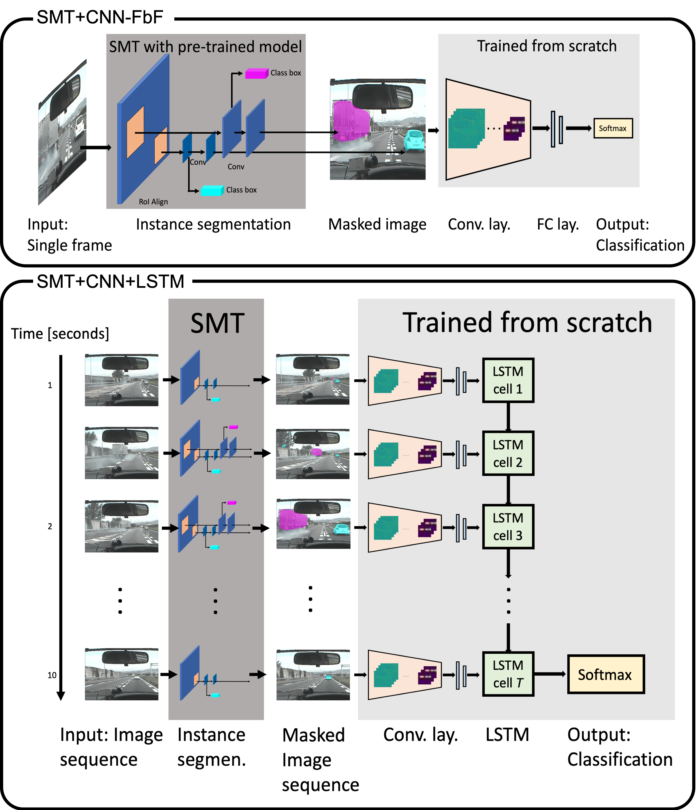

# DeepTL-Lane-Change-Classification
Infers the risk level of lane change video clips. Utilizes deep transfer learning (TL). The related paper is submitted to IEEE ITSC 2019. The preprint of the article is available at https://arxiv.org/abs/1906.02859 

## Features: 
* A novel deep spatiotemporal framework for risky action detection in short lane change video clips
* Using only a monocular camera for the task
* Two versions are available with trained weights! : ResNet50 (TL) + LSTM and MaskRCNN (TL) + CNN + LSTM.
* Two lane change video samples are provided in data/input/lc_samples_50frames.tar.gz 
* Currently only works with a GPU. CPU models will be added in the future.

## Examples:

Here are the two examples. The left lane change is classified as safe and the right lane change is classified as risky.

  

## Installation:

1- Clone the repo and install the  dependencies:

    $git clone https://github.com/Ekim-Yurtsever/DeepTL-Lane-Change-Classification.git
    $cd DeepTL-Lane-Change-Classification/
    $pip install -r requirements.txt
 
 2- [Only for the MaskRCNN based model] Download MaskRCNN weights from https://www.dropbox.com/s/n81pagybkj8p5w1/mask_rcnn_coco.h5?dl=0 and move it to /test
   
PLEASE NOTE: Install in a fresh python 3.6 environment with the above commands. If you use different versions of keras or tensorflow-GPU, the trained models will either not work or give false results!! The trained models will only work with the specific tensorflow-gpu version that I used to train the networks with our data (the data is not open access). I will add CPU models later. If you don't get the results mentioned below, please check the dependencies and compare them to the requirements.txt file.

## Hardware requirements

The following GPU-enabled devices are supported:

    NVIDIA® GPU card with CUDA® Compute Capability 3.5 or higher. See the list of CUDA-enabled GPU cards.

Please check https://www.tensorflow.org/install/gpu for installing the neccessary drivers.

I used a GeForce GTX 1080 Ti to train the models.

## Prediction example:

1- Extract the contents of lc_samples_50frames.tar.gz in data/input. The folder structure after extraction should look like the following:

    .
    ├── Mask_RCNN                                    # Mask RCNN implementation by Matterport
    ├── data                                         # Data dir
    │   ├── input 
    │   │   ├── 1                                    # The first lane change sequence
    │   │   │   ├── 260_7308.jpg                     # First frame of LC1
    │   │   │   ├── 260_7317.jpg                     # Second frame of LC1
    │   │   │   ├── ...      
    │   │   │   ├── 260_7317.jpg                     # 50th frame of LC1. The original footage was captured with 30 fps. However, we can only share the downsampled version here :(. Each lane change sequence was downsampled to have 50 frames in total.
    │   │   ├── 2                                    # The second lane change sequence
    │   │   │   ├── 697_14899.jpg                    # First frame of LC2
    │   │   │   ├── ...                
    │   ├── extracted_features                       
    │   ├── masked_images                      
    ├── example_gifs                    
    ├── lane_change_risk_detection                   # Source code of this project
    ├── test                                         # test prediction and training scripts to get started!
    ├── ...
 
2- Run test/sample_prediction_resnet_lstm.py:

This will infer the risk level of all lane changes in the folder  data/input/.. and print the result. This script uses the ResNET backbone for risk inference. This is faster than MaskRCNN based semantic mask transfer backbone but has lower performance. For the provided sample lane change sequences, the result should look like the following:

      
      safe | dangerous 
      [[0.9169345  0.08306556]
      [0.13948527 0.8605147 ]]

This means the first lane change is classified as safe (0.91), and the second lane change is classified as dangerous (0.86).

3- Run test/sample_prediction_maskRCNN_lstm.py:

This will do the same thing with the MaskRCNN backbone. Also, the masked images will be saved to /data/masked_images . This method has higher performance, but it is slower. The risk inference result should look like the following:

      safe | dangerous 
      [[0.9703818  0.02961819]
      [0.06648535 0.9335146 ]]

4- If you want to use the trained model to infer the risk level of your own lane change data, simply add more lane change folders under data/input/.. with numerical foldernames such as 3, 4, .... The sample_prediction_resnet_lstm.py will infer the risk level of all lane changes in the input folder.

## Architecture
The architecture of the model is shown below. SMT stands for "Semantic Mask Transfer." Please check our [paper](https://arxiv.org/abs/1906.02859) for details.

 

## Credits:

[Mask R-CNN implementation by Matterport](https://github.com/matterport/Mask_RCNN) is utilized for the segmentation part of this project.

## Coming soon:

-The full release will be available soon. Stay tuned for updates!
